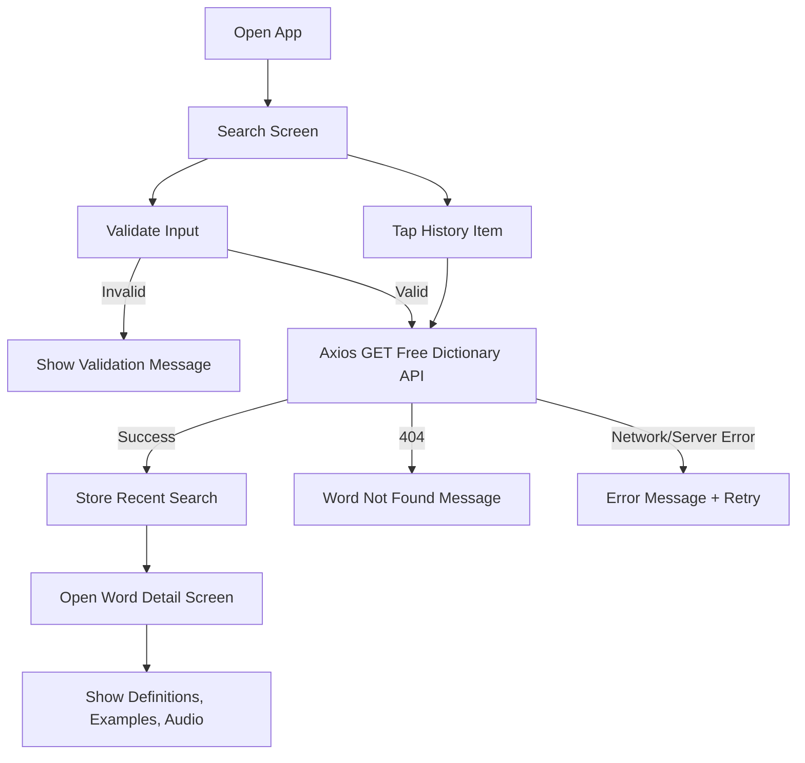
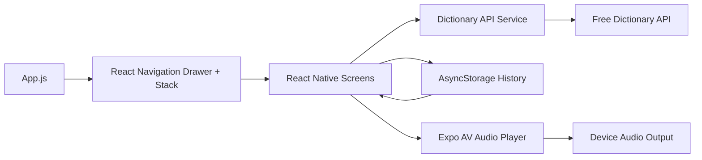

# LexiDict - Dictionary Mobile App

A cross-platform dictionary app built with React Native and Expo.

## Features

- Word search with Axios and the Free Dictionary API
- Detailed word view with phonetics, parts of speech, definitions, and examples
- Audio pronunciation with Expo AV
- Local search history with AsyncStorage
- Drawer navigation for Search and History
- Loading, empty, and error states

## Project Structure

```text
App.js
src/
  components/
  context/
  navigation/
  screens/
  services/
  storage/
  utils/
```

## Clean Submission Notes

- The project uses a single navigation system with React Navigation.
- Unused Expo Router starter files and template components were removed.
- Only the dictionary app files and required dependencies are kept.

## API Endpoint

- `GET https://api.dictionaryapi.dev/api/v2/entries/en/{word}`

## Screens

- Search Screen
- Word Detail Screen
- History Screen

## Entities / Models

- `DictionaryEntry`
- `Phonetic`
- `Meaning`
- `Definition`
- `SearchHistoryItem`

## Flow Diagram



## Architecture Diagram



## Setup

1. Install dependencies:

```bash
npm install
```

2. Start the app:

```bash
npm start
```

3. Run on Android:

```bash
npm run android
```

4. Run on iOS:

```bash
npm run ios
```

## Notes

- Search accepts English words only.
- Search history is stored locally and persists after restart.
- Audio playback uses the first valid pronunciation audio returned by the API.
- The app is ready for Android, iOS, and web through Expo.
