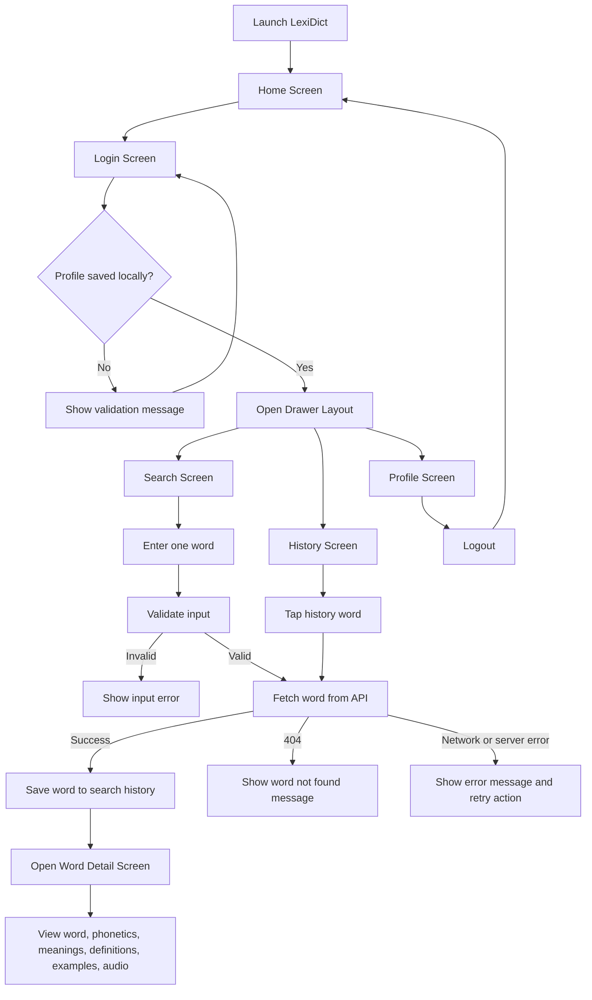

```mermaid
flowchart TD
  A["Launch LexiDict"] --> B["Home Screen"]
  B --> C["Login Screen"]
  C --> D{"Profile saved locally?"}
  D -->|No| E["Show validation message"]
  E --> C
  D -->|Yes| F["Open Drawer Layout"]
  F --> G["Search Screen"]
  F --> H["History Screen"]
  F --> I["Profile Screen"]
  G --> J["Enter one word"]
  J --> K["Validate input"]
  K -->|Invalid| L["Show input error"]
  K -->|Valid| M["Fetch word from API"]
  M -->|Success| N["Save word to search history"]
  N --> O["Open Word Detail Screen"]
  O --> P["View word, phonetics, meanings, definitions, examples, audio"]
  M -->|404| Q["Show word not found message"]
  M -->|Network or server error| R["Show error message and retry action"]
  H --> S["Tap history word"]
  S --> M
  I --> T["Logout"]
  T --> B
```
