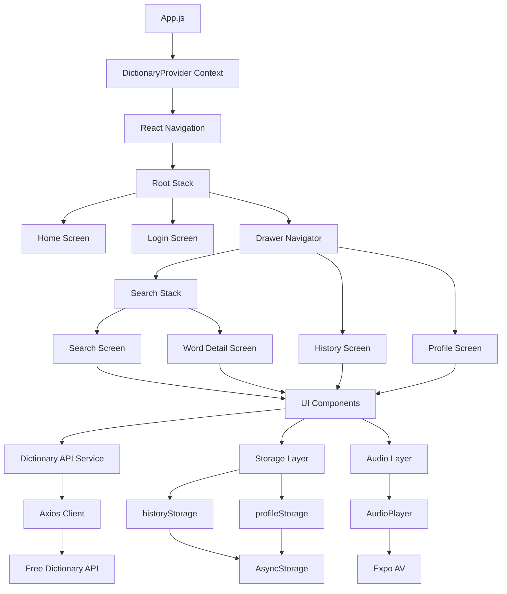

```mermaid
flowchart TB
  APP["App.js"] --> PROVIDER["DictionaryProvider Context"]
  PROVIDER --> NAV["React Navigation"]
  NAV --> ROOT["Root Stack"]
  ROOT --> HOME["Home Screen"]
  ROOT --> LOGIN["Login Screen"]
  ROOT --> DRAWER["Drawer Navigator"]

  DRAWER --> SEARCHSTACK["Search Stack"]
  DRAWER --> HISTORY["History Screen"]
  DRAWER --> PROFILE["Profile Screen"]
  SEARCHSTACK --> SEARCH["Search Screen"]
  SEARCHSTACK --> DETAILS["Word Detail Screen"]

  SEARCH --> COMPONENTS["UI Components"]
  DETAILS --> COMPONENTS
  HISTORY --> COMPONENTS
  PROFILE --> COMPONENTS

  COMPONENTS --> API["Dictionary API Service"]
  COMPONENTS --> STORAGE["Storage Layer"]
  COMPONENTS --> AUDIO["Audio Layer"]

  API --> AXIOS["Axios Client"]
  AXIOS --> FREEAPI["Free Dictionary API"]

  STORAGE --> HIST["historyStorage"]
  STORAGE --> PROF["profileStorage"]
  HIST --> ASYNC["AsyncStorage"]
  PROF --> ASYNC

  AUDIO --> PLAYER["AudioPlayer"]
  PLAYER --> EXPOAV["Expo AV"]
```
