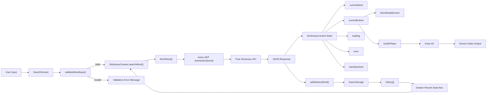

```mermaid
flowchart LR
  U["User Input"] --> V["SearchScreen"]
  V --> W["validateWordInput()"]
  W -->|Valid| X["DictionaryContext.searchWord()"]
  W -->|Invalid| Y["Validation Error Message"]
  X --> Z["fetchWord()"]
  Z --> AA["Axios GET /entries/en/{word}"]
  AA --> AB["Free Dictionary API"]
  AB --> AC["JSON Response"]
  AC --> AD["DictionaryContext State"]
  AD --> AE["currentWord"]
  AD --> AF["currentEntries"]
  AD --> AG["loading"]
  AD --> AH["error"]
  AD --> AI["hasSearched"]
  AC --> AJ["addHistoryWord()"]
  AJ --> AK["AsyncStorage"]
  AK --> AL["history[]"]
  AF --> AM["WordDetailScreen"]
  AL --> AN["Drawer Recent Searches"]
  AN --> X
  AF --> AO["AudioPlayer"]
  AO --> AP["Expo AV"]
  AP --> AQ["Device Audio Output"]
```
